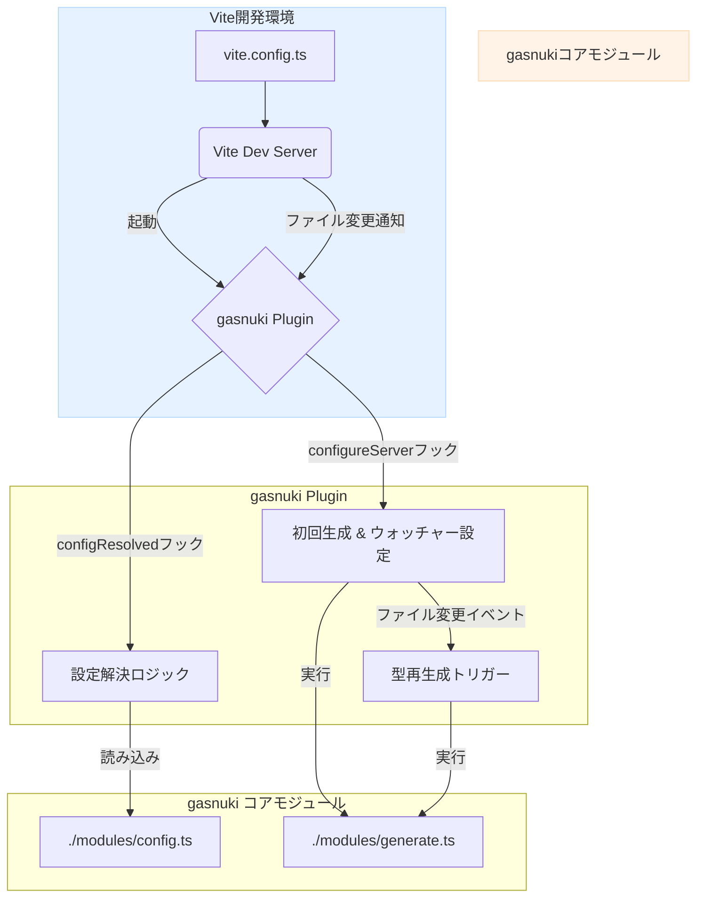
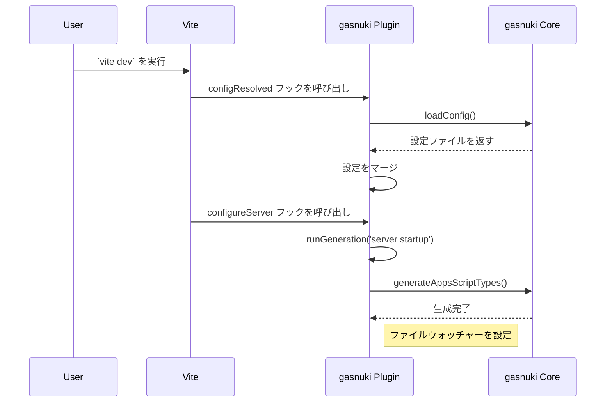
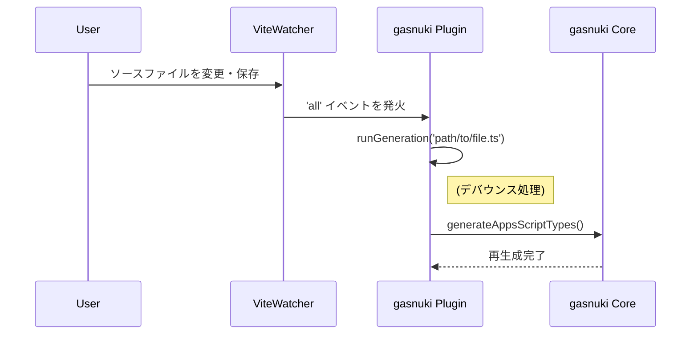

# `@ciderjs/gasnuki` Viteプラグイン 設計書

## 1. はじめに

### 1.1. 目的

本ドキュメントは、先に作成された「`@ciderjs/gasnuki` Viteプラグイン機能追加 要件定義書」に基づき、Viteプラグイン機能の具体的なアーキテクチャ、実装詳細、データ構造などを定義することを目的とする。

### 1.2. 対象読者

`@ciderjs/gasnuki` の開発者およびコントリビューターを対象とする。

## 2. アーキテクチャ概要

`@ciderjs/gasnuki` のViteプラグインは、Viteの開発サーバーのライフサイクルにフックすることで動作する。既存の型生成コアロジック (`generateAppsScriptTypes`) を再利用し、Viteの開発環境とシームレスに連携する。

### 2.1. 構成図



### 2.2. 処理フロー

1. **設定解決**: Vite開発サーバー起動時、`configResolved` フックが発火。Viteの設定情報 (`config.root`) を元にプロジェクトルートを特定し、プラグインオプション、`gasnuki.config.ts`、デフォルト値をマージして最終的な設定を確定する。
2. **初回生成**: `configureServer` フックで、開発サーバーの起動処理の一環として、型定義の初回生成 (`generateAppsScriptTypes`) を実行する。
3. **ファイル監視と再生成**: 同じく `configureServer` フック内で、Viteのファイルウォッチャー (`server.watcher`) を利用して、設定されたソースディレクトリ (`srcDir`) を監視する。ファイルの追加・変更・削除を検知すると、再度 `generateAppsScriptTypes` を実行して型定義を更新する。

## 3. ファイル構成

| ファイルパス         | 状態 | 役割                                                                                                |
| :------------------- | :--- | :-------------------------------------------------------------------------------------------------- |
| `src/vite.ts`        | 新規 | Viteプラグインのロジックを実装する。プラグインのファクトリ関数 `gasnuki()` をエクスポートする。         |
| `package.json`       | 変更 | `exports` フィールドに `./vite` エントリーポイントを追加し、Viteプラグインを外部から利用可能にする。    |
| `build.config.ts`    | 変更 | `unbuild` のビルド対象に `src/vite.ts` を追加する。                                                   |
| `src/modules/generate.ts` | 変更 | (必要であれば) Vite環境でのロギングやエラーハンドリングを改善するために軽微な修正を行う可能性がある。 |
| `src/modules/config.ts`   | 変更なし | 既存のコンフィグローダーをそのまま利用する。                                                        |

## 4. 詳細設計

### 4.1. Viteプラグインエントリーポイント (`src/vite.ts`)

プラグインは `gasnuki(options?: UserConfig): Plugin` というファクトリ関数として提供する。

```typescript:gasnuki Vite Plugin:src/vite.ts
import type { Plugin, ResolvedConfig, ViteDevServer } from 'vite';
import * as path from 'node:path';
import { consola } from 'consola';
import { generateAppsScriptTypes } from './modules/generate';
import { loadConfig, type UserConfig } from './modules/config';
import type { GenerateOptions } from './index';

/**
 * A factory function to create the gasnuki Vite plugin.
 * @param options - The user-defined configuration for gasnuki.
 * @returns The Vite plugin object.
 */
export function gasnuki(options?: UserConfig): Plugin {
  let projectRoot: string;
  let gasnukiOptions: Omit<GenerateOptions, 'watch' | 'project'>;

  // Debounce mechanism to prevent rapid-fire regeneration
  let debounceTimer: NodeJS.Timeout | null = null;
  const debounce = (func: () => void, timeout = 300) => {
    if (debounceTimer) {
      clearTimeout(debounceTimer);
    }
    debounceTimer = setTimeout(func, timeout);
  };

  const runGeneration = (triggeredBy?: string) => {
    debounce(async () => {
      const reason = triggeredBy ? ` (triggered by: ${triggeredBy})` : '';
      consola.info(`[gasnuki] Generating AppsScript types${reason}...`);
      try {
        await generateAppsScriptTypes({
          ...gasnukiOptions,
          project: projectRoot,
        });
        consola.success('[gasnuki] Type generation complete.');
      } catch (e) {
        consola.error(`[gasnuki] Type generation failed: ${(e as Error).message}`);
      }
    });
  };

  return {
    name: 'vite-plugin-gasnuki',
    apply: 'serve', // Apply only in serve mode

    async configResolved(config: ResolvedConfig) {
      projectRoot = config.root;
      const fileConfig = await loadConfig(projectRoot);
      const defaultOptions: Partial<GenerateOptions> = {
        srcDir: 'server',
        outDir: 'types',
        outputFile: 'appsscript.ts',
      };
      gasnukiOptions = {
        ...defaultOptions,
        ...fileConfig,
        ...(options || {}),
      };
    },

    async configureServer(server: ViteDevServer) {
      const targetDir = path.resolve(projectRoot, gasnukiOptions.srcDir);

      // Initial generation on server startup
      runGeneration('server startup');

      // Watch for file changes
      server.watcher.on('all', (event, filePath) => {
        // Normalize paths for reliable comparison
        const normalizedFilePath = path.normalize(filePath);
        const normalizedTargetDir = path.normalize(targetDir);

        if (normalizedFilePath.startsWith(normalizedTargetDir)) {
          runGeneration(path.relative(projectRoot, filePath));
        }
      });
    },
  };
}
```

### 4.2. 設定解決ロジック (`configResolved` フック内)

1. `config.root` からプロジェクトのルートパスを取得する。
2. 既存の `loadConfig(projectRoot)` を呼び出し、`gasnuki.config.ts` の内容を読み込む。
3. 以下の優先順位で設定をマージし、`gasnukiOptions` として内部に保持する。
    1. **高**: `vite.config.ts` でプラグインに渡された `options`
    2. **中**: `gasnuki.config.ts` の内容
    3. **低**: プラグイン内部で定義されたデフォルト値 (`srcDir`, `outDir`, `outputFile`)

### 4.3. ファイル監視ロジック (`configureServer` フック内)

- Viteの `server.watcher` を利用することで、`chokidar` を直接依存関係に追加する必要はない。
- `on('all', callback)` を使用し、ファイルの追加(`add`)、変更(`change`)、削除(`unlink`) すべてのイベントを捕捉する。
- イベントのコールバック内で、変更されたファイルパスが `gasnukiOptions.srcDir` 内に存在するかをチェックし、関係のないファイルの変更で再生成が走らないようにする。
- 頻繁なファイル変更による過剰な再生成を防ぐため、300ms程度のデバウンス処理を実装する。
- **キャッシュ機構**:
  - `generateAppsScriptTypes` 内部にモジュールレベルのキャッシュ (`generationCache`) を実装する。
  - ソースファイルのパスと内容に基づくハッシュ値を計算し、前回の生成時から変更がない場合は生成処理をスキップする。
  - ユーザーは `cache: false` オプションを指定することで、このキャッシュ機構を無効化できる（デフォルトは有効）。

## 5. データ構造・インターフェース

### 5.1. `UserConfig` (既存)

既存の `UserConfig` 型をそのままプラグインオプションの型として利用する。

```typescript
// src/modules/config.ts (既存)
export type UserConfig = Partial<Omit<GenerateOptions, 'watch' | 'project'>>;
```

## 6. シーケンス図

### 6.1. 開発サーバー起動時



### 6.2. ファイル変更時



## 7. その他考慮事項

- **エラー表示**: `generateAppsScriptTypes` が例外をスローした場合、`consola.error` を使用してViteのコンソールにスタックトレースを含む詳細なエラー情報を出力する。これにより、開発者はエラーの原因を特定しやすくなる。
- **テスト**: Viteプラグインの動作を検証するための単体テスト・結合テストを追加する。`vite` を `devDependencies` に追加し、テスト環境内でViteサーバーをプログラム的に起動してプラグインの各フックが正しく動作するかを確認する。
